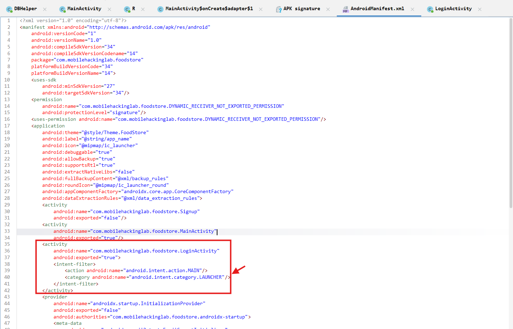
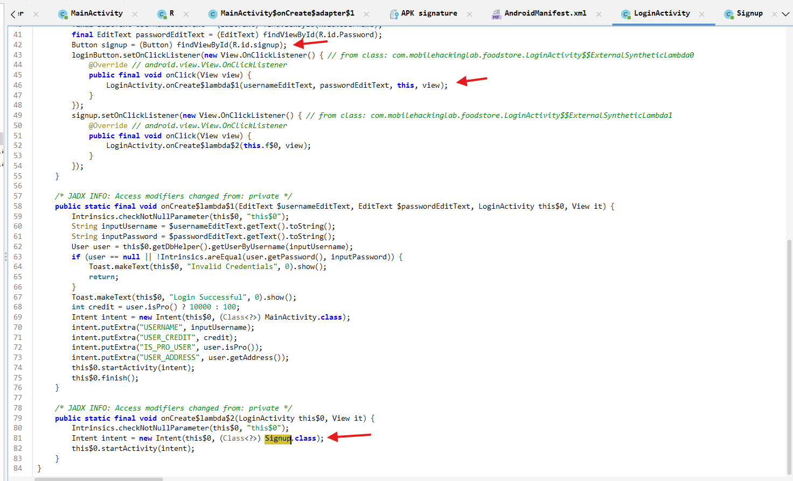
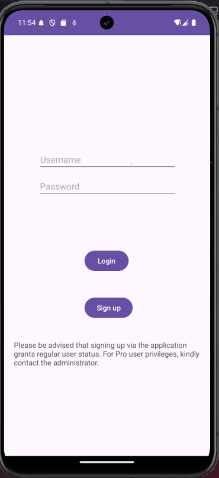
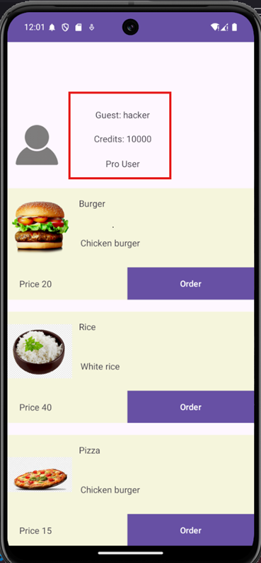

**Objective:** Exploit a SQL Injection Vulnerability: Your mission is to manipulate the signup function in the "Food Store" Android application, allowing you to register as a Pro user, bypassing standard user restrictions

**Challenge:** https://www.mobilehackinglab.com/course/lab-food-store

<p align="center">
  
</p>

## Static Analysis
Install the APK using `adb shell`
```bash
adb install FoodStore.apk
```
Using a reverse-engineering tool like `JADX-GUI`, the **source code** of the application can be read.
Inspecting the source code, starting with the `AndroidManifest.xml` file. We can see that the first activity invoked when the application open is the `LoginActivitiy`


From the `LoginActivity` class, we can see that if user is logged in successfully, they can be of either role **Pro** or **normal**. The difference being the credit amount given.
```java
Toast.makeText(this$0, "Login Successful", 0).show();
int credit = user.isPro() ? 10000 : 100;
```
Also in this class, we see a button towards the `Signup` class, which is another activity.

Inspecting the `Signup` class we can see various checks for input field to ensure that no field are empty. However, interestingly there is a connection toward the `dbHelper` class which attempt to add a new user.
```java
User newUser = new User(i, string, string2, editText2.getText().toString(), false, 1, null);
dbHelper.addUser(newUser);
Toast.makeText(this$0, "User Registered Successfully", 0).show();
return;
```
It is in `DBHelper` do we see a vulnerable snippet of the SQLi vulnerability (line 41).
```java
String Username = user.getUsername();
byte[] bytes2 = user.getAddress().getBytes(Charsets.UTF_8);
Intrinsics.checkNotNullExpressionValue(bytes2, "this as java.lang.String).getBytes(charset)");
String encodedAddress = Base64.encodeToString(bytes2, 0);
String sql = "INSERT INTO users (username, password, address, isPro) VALUES ('" + Username + "', '" + encodedPassword + "', '" + encodedAddress + "', 0)";
db.execSQL(sql);
db.close();
```
Inspecting the code, `password` and `address` is base64 encoded when added to the DB, and `isPro` value is `1` or `0` representing `true` or `false`. A maliciously crafted payload changing the `isPro` value can allow creation of a **Pro** account.
```
hacker', '<BASE64_PASS>', '', 1); --
```

## Dynamic Analysis
Using an emulator, we can see that opening  the application lead us to the `Login` activity, there is also a `Signup` button.



Navigating to the `Signup` activity, inputing the crafted payload in the `username` field, an account is created successfully.


Login to the application with the account created. 
**Result:** Notice the credit of the account, a **Pro** account was created.



## Mitigation
- Use **parameterized queries** (prepared statements) instead of concatenating user input to SQL queries.
- **Always** hash sensitive information with strong algorithms like SHA256, SHA-512... in data storage.
- **Input sanitization**, however, this will depend on the feature as well (can address have ' in them).

```java
String Username = user.getUsername();
byte[] bytes2 = user.getAddress().getBytes(Charsets.UTF_8);
Intrinsics.checkNotNullExpressionValue(bytes2, "this as java.lang.String).getBytes(charset)");
String encodedAddress = Base64.encodeToString(bytes2, 0);

// Parameterized SQL statement with placeholders
String sql = "INSERT INTO users (username, password, address, isPro) VALUES (?, ?, ?, ?)";

SQLiteStatement stmt = db.compileStatement(sql);

// Bind values to statement
stmt.bindString(1, Username);
stmt.bindString(2, encodedPassword);
stmt.bindString(3, encodedAddress);
stmt.bindLong(4, 0); // isPro = 0

stmt.executeInsert();
stmt.close();
db.close();
```


